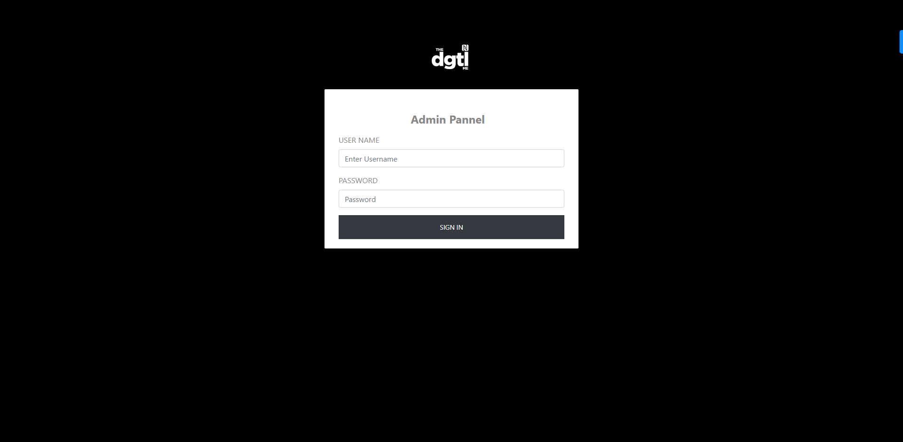
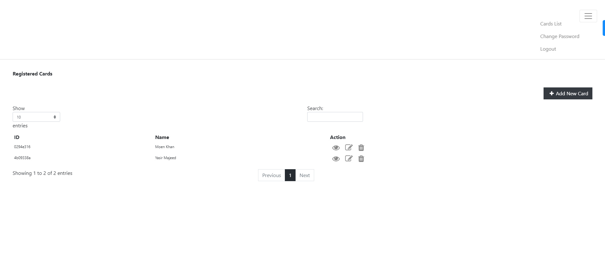
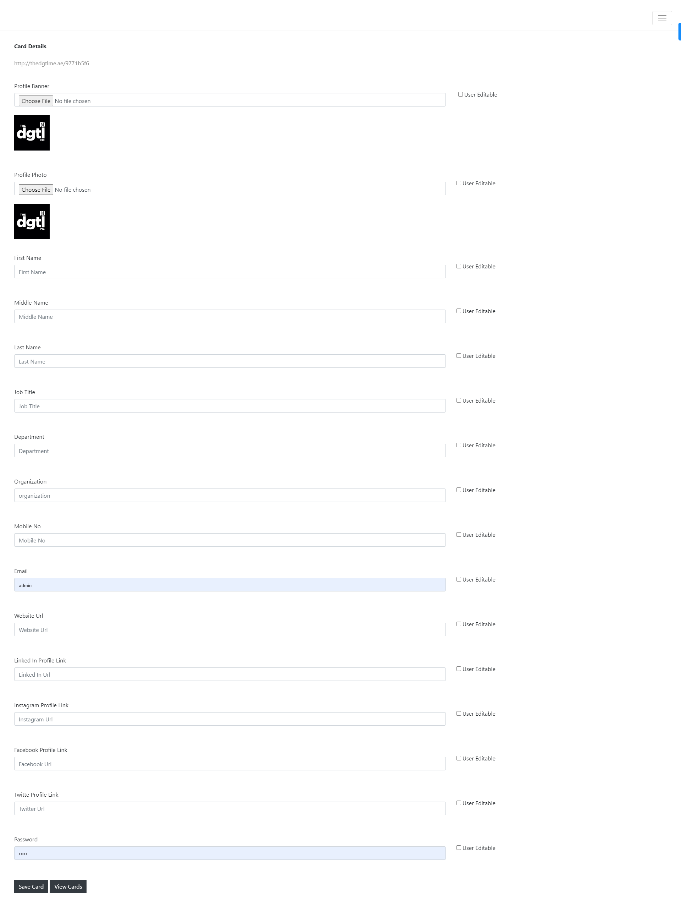

# Virtual Visiting Cards

Virtual Visiting Cards is a web-based application developed in PHP and MySQL, allowing users to create and store digital versions of their visiting cards. The application simplifies the process of sharing contact information with others in a digital format.

## Features

The application offers the following key features:

- **Admin Panel:**
  - Admin can add new visiting card details, including name, contact information, company details, and other relevant data.
  - The card details are stored in a MySQL database.

- **Visiting Card Generation:**
  - The application generates virtual visiting cards based on the data stored in the database.
  - Users can view, download, and share their generated cards with others.

## Technology Stack

The application is built using the following technologies:

- **Backend:**
  - PHP: Server-side scripting language for handling backend logic and database interactions.
  - MySQL: Relational database management system for storing and managing visiting card data.

- **Frontend:**
  - HTML: Markup language for structuring the web pages.
  - CSS: Stylesheet language for styling the web pages.

## Installation and Setup

1. Clone the repository:
2. Upload the downloaded folder in the root folder of your server.
3. Import the database vcard.sql
4. Update the database details in the user and Admin folder.
5. Once all Done your application is ready.

## Images

## Login Details
username: admin
password: admin

   
